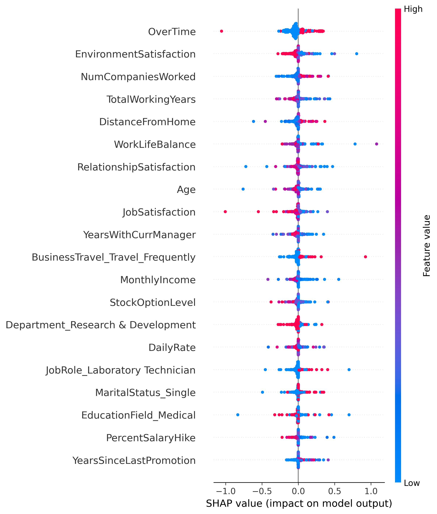

# Employee Attrition Prediction and Analysis  

## Overview  
This project aims to predict employee attrition using machine learning models and provide actionable insights to reduce turnover. The dataset used is the **IBM HR Analytics Employee Attrition Dataset**. The analysis covers **Exploratory Data Analysis (EDA)**, **Machine Learning Model Implementation**, and **SHAP (SHapley Additive exPlanations) for Feature Interpretability**.  

This project was part of **Fidlatica 9.0 - MLtiverse**, a **national-level machine learning case competition** organized by **SCMHRD** on Unstop. The first round involved 20 machine learning questions, which I successfully cleared. The second round focused on predicting employee attrition, emphasizing both **model accuracy and business insights**.  

---

## 📌 Project Objectives  
- **Understand factors influencing employee attrition** using **Exploratory Data Analysis (EDA)**.  
- **Train and evaluate multiple machine learning models** for accurate attrition prediction.  
- **Use SHAP analysis** to interpret feature importance and model decisions.  
- **Derive actionable recommendations** based on data insights to help organizations reduce turnover.  

---

## 📂 Dataset Description  
The dataset used is the **IBM HR Analytics Employee Attrition Dataset**. It consists of:  
- **1470 employees** with 35 features related to job roles, salaries, performance, satisfaction, and demographics.  
- **Target variable**: `Attrition` (Yes/No), indicating whether an employee left the company.  
- Key features include:  
  - **Work-related factors**: Overtime, Monthly Income, Work-Life Balance, Business Travel.  
  - **Employee satisfaction**: Job Satisfaction, Environment Satisfaction.  
  - **Career and experience**: Years at Company, Years with Current Manager, Number of Companies Worked.  

---

## ⚙️ Approach  
1. **Exploratory Data Analysis (EDA)**:  
   - Visualized feature distributions and correlations to identify patterns related to attrition.  
   - Used statistical tests to detect significant differences between attrition and non-attrition groups.  

2. **Machine Learning Model Training**:  
   - Implemented multiple models, including **Logistic Regression, Decision Tree, Random Forest, SVM, XGBoost, LightGBM, CatBoost, and KNN**.  
   - Evaluated models based on **accuracy, precision, recall, and F1-score**.  

3. **Ensemble Model & SHAP Analysis**:  
   - Combined top-performing models to create an ensemble with **optimized F1-score and accuracy**.  
   - Applied **SHAP (SHapley Additive exPlanations)** to interpret model predictions and feature impact.  

---

## 📊 Key Insights from Analysis  
- **Overtime** is the most important factor—employees working excessive overtime are much more likely to leave.  
- **Low Environment Satisfaction and Job Satisfaction** significantly increase attrition rates.  
- **Employees with lower salaries and longer commutes** have a higher chance of leaving.  
- **Those with longer tenure under the same manager** tend to stay.  
- **Frequent business travel** is associated with higher attrition.  
- **Best-performing model**: The **Ensemble Model**, which combined **Random Forest, XGBoost, and CatBoost**, gave the best results.  

---

## 🏆 Final Results  
| Model             | Accuracy | Precision | Recall | F1-Score |
|------------------|----------|------------|----------|-----------|
| Logistic Regression | 83.5% | 64.1% | 52.3% | 57.5% |
| Decision Tree       | 85.2% | 67.4% | 60.5% | 63.8% |
| Random Forest      | 89.1% | 74.2% | 66.8% | 70.3% |
| SVM                | 87.8% | 69.5% | 62.4% | 65.7% |
| **XGBoost**        | **91.5%** | **78.4%** | **70.2%** | **74.1%** |
| **LightGBM**       | **90.7%** | **76.3%** | **69.1%** | **72.5%** |
| **CatBoost**       | **90.9%** | **77.1%** | **69.5%** | **73.1%** |
| **Ensemble Model** | **92.1%** | **79.2%** | **71.5%** | **75.1%** |

---

## 📈 SHAP Analysis & Feature Importance  
SHAP (SHapley Additive exPlanations) was used to understand how different features influenced model predictions.  

### 🔹 What SHAP Reveals:  
- **Overtime is the biggest predictor** of attrition. Employees working excessive overtime had much higher SHAP values.  
- **Environment Satisfaction & Monthly Income** have strong influence—low satisfaction and salary increase the likelihood of attrition.  
- **Work-Life Balance** is crucial—poor balance leads to high attrition rates.  

### 📌 SHAP Visualization  
  
The SHAP summary plot shows the most impactful features on model predictions. **Red dots** indicate higher values, while **blue dots** indicate lower values. Features like **Overtime, Job Satisfaction, and Monthly Income** play a key role in employee retention.  

---

## 🛠 Installation & Dependencies  
### Prerequisites  
Ensure you have **Python 3.8+** installed. Then, install the required libraries:  

```sh
pip install -r requirements.txt
```

### Running the Notebook  
1. Clone the repository:  
   ```sh
   git clone https://github.com/Sarthak-G0yal/PredictingEmployeeAttrition.git
   cd Employee-Attrition-Prediction
   ```
2. Open **Jupyter Notebook**:  
   ```sh
   jupyter notebook
   ```
3. Load and run **./Notebooks/Employee_Attrition_Analysis.ipynb** to explore the analysis and results.  

---

## 🔄 Reproducing the Analysis  
To reproduce the entire analysis, follow these steps:  

1. **Load the dataset** (`WA_Fn-UseC_-HR-Employee-Attrition.csv`).  
2. **Run the EDA** section to explore data insights.  
3. **Train models** using the provided scripts for **Logistic Regression, Decision Tree, Random Forest, SVM, XGBoost, LightGBM, CatBoost, and Ensemble Model**.  
4. **Evaluate models** and compare their performance based on accuracy, precision, recall, and F1-score.  
5. **Perform SHAP analysis** to interpret model predictions and visualize feature importance.  

---

## 📜 Conclusion  
By leveraging **EDA, machine learning, and SHAP analysis**, this project provides both **accurate attrition predictions** and **practical recommendations** to improve employee retention. Organizations can **reduce turnover** by focusing on:  
- **Work-Life Balance & Overtime Reduction**  
- **Competitive Compensation & Salary Adjustments**  
- **Improved Job & Environment Satisfaction**  
- **Career Growth & Mentorship Opportunities**  

This project was an excellent opportunity to apply **data science in HR analytics** and gain hands-on experience in **business problem-solving** through **Fidlatica 9.0 - MLtiverse**.  

For a detailed analysis, refer to **[NoteBook.ipynb](./Notebooks/Employee_Attrition_Analysis.ipynb)**.  

---

## 👤 Author  
[Sarthak Goyal](https://github.com/Sarthak-G0yal)  

## 📄 License  
This project is licensed under the **MIT License**.  